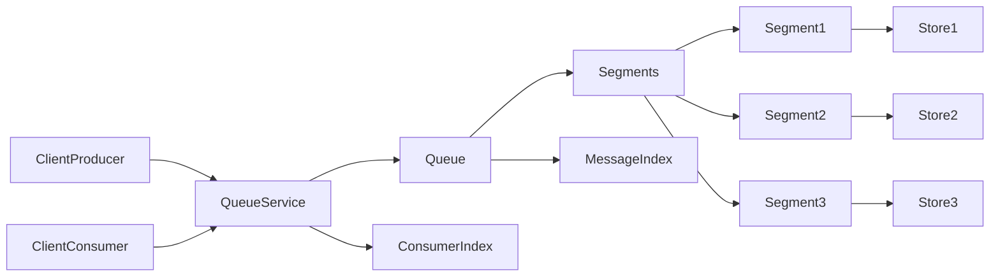

# Distributed Queue - Action Plan & Architecture

## I. Overall Architecture

The system will consist of a **Queue Server** that manages the segmented log,
in-memory index, and client connections. **Queue Clients** (producers and
consumers) will interact with the server to enqueue and dequeue messages.

## II Components and Interactions

1. Queue Server:
   - Responsibilities:
     - Accepts connections from producers and consumers.
     - Manages the segmented log for durable message storage.
     - Maintains the in-memory index for efficient message lookups.
     - Handles enqueue requests from producers.
     - Handles dequeue requests from consumers.
     - Persists consumer read offsets.
     - Manages segment rollover.
     - Handles index snapshotting and recovery.
   - Interactions:
     - Receives enqueue requests (byte arrays) from `ClientProducer`.
     - Appends messages to the `SegmentedLog`.
     - Updates the `InMemoryIndex` with message IDs and offsets.
     - Receives dequeue requests (for the next message) and acknowledgements
       from `ClientConsumer`.
     - Retrieves messages from `SegmentedLog` using the `InMemoryIndex`.
     - Reads and writes consumer offsets to `PersistentStorage`.

2. Segmented Log:
   - Responsibilities:
     - Durable storage of enqueued messages on disk.
     - Organized into segments of a configurable maximum size.
     - Provides sequential write access to the active segment.
     - Provides read access to all segments.
   - Interactions:
     - Appended to by the `QueueServer` during enqueue operations.
     - Read from by the `QueueServer` during dequeue operations and index
       recovery.

3. In-Memory Index:
   - Responsibilities
     - Provides fast lookups of message locations (segment number and offset) by
       global message ID.
     - Built in-memory for read performance
   - Interactions
     - Updated by the `QueueServer` after each successful enqueue.
     - Read by the `QueueServer` to locate messages for dequeue.
     - Periodically snapshotted to disk by the `QueueServer`.
     - Rebuilt from snapshots and logs by the `QueueServer` on startup.

4. Persistent Storage (Consumer Offsets):
    - Responsibilities:
        - Durable storage of the last successfully processed global message ID for each consumer.
    - Interactions:
        - Read and written to by the `QueueServer` when consumers connect, dequeue, and acknowledge messages.    
5. Client Producer:
    - Responsibilities:
        - Connects to the `QueueServer`.
        - Sends byte array messages to be enqueued.
    - Interactions:
        - Establishes a connection (e.g., WebSocket) with the `QueueServer`.
        - Sends enqueue requests containing the message payload.
6. Client Consumer:
    - Responsibilities:
        - Connects to the QueueServer.
        - Requests the next message in the queue.
        - Acknowledges successfully processed messages.
        - Persists its last processed message ID (optional, server can manage).
    - Interactions:
        - Establishes a connection (e.g., WebSocket) with the QueueServer.
        - Sends dequeue requests.
        - Receives messages from the QueueServer.
        - Sends acknowledgements for processed messages to the QueueServer.

## Key Considerations
- Concurrency Control:
    - Single writer goroutine for the active log segment.
    - sync.RWMutex for concurrent access to the in-memory index.
- Durability:
    - Writing messages to disk in the segmented log.
    - Periodic snapshotting of the in-memory index.
    - Persistent storage of consumer read offsets.
- Index Recovery:
    - Loading the latest index snapshot on startup.
    - Replaying log segments created after the snapshot to rebuild the index for newer messages.
- Sequential Consumption:
    - The server tracks the last read position for each consumer.
    - Consumers request the "next" message based on their last processed ID.
    - Consumer Identification:
    - The server will assign auto-generated unique IDs to connecting consumers.
- Connection Mechanism:
    - Start with WebSockets for bidirectional communication.
- Error Handling:
    - Implement robust error handling for file I/O operations, network issues, and concurrent access.
- Configuration:
    - Make key parameters like segment size configurable.
- Testing:
    - Thoroughly test concurrent enqueue and dequeue operations, as well as recovery scenarios.